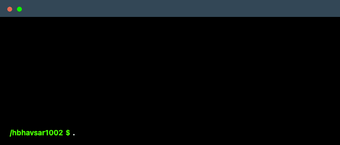

  

# 👋 Hi, I’m Harsh Hirenkumar Bhavsar

  
  

---

- 🔭 Building scalable cloud data pipelines  
- 🌱 Learning advanced **dbt**, **Kafka**, **AI/ML**, and **CRISPR data applications**  
- 👯 Open to collaborations in **Data Engineering** and **Data Analytics**  
- 💬 Tech stack: **Python, SQL, Azure Cloud, Apache Spark, Databricks, Power BI, Tableau**  
- 💼 Open to full-time roles: **Data Engineering | Data Analytics | Data Science**  
- ⚡ Fun fact: I turn computer science concepts into poems and haikus  

---

### 🧔 What I do when I’m not writing code
- ✨ **Interests**: Poetry, Board Games, Astrology  
- 🎮 **Video Games**: Call of Duty  
- 🎥 **Movies**: *Return to the 36th Chamber*  
- 📺 **TV Shows**: *One Piece*, *Family Guy*
- 📚 **Books**: *The President’s Daughter* — Jack Higgins  
- 🎵 **Music**: Jaubi — *Time: Donut of the Heart*  
  👉 [Spotify Playlists](https://open.spotify.com/user/316qpbk34qrwl4icuvmvscb2wfty/playlists)
